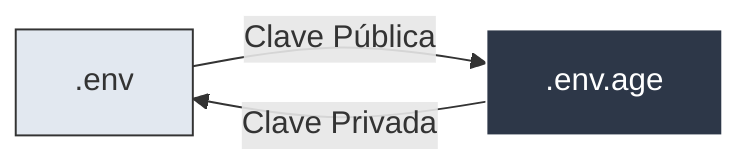
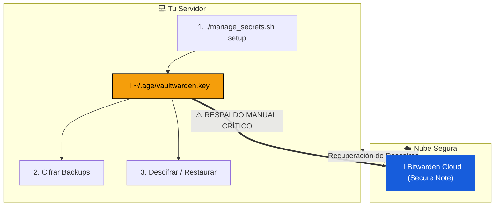
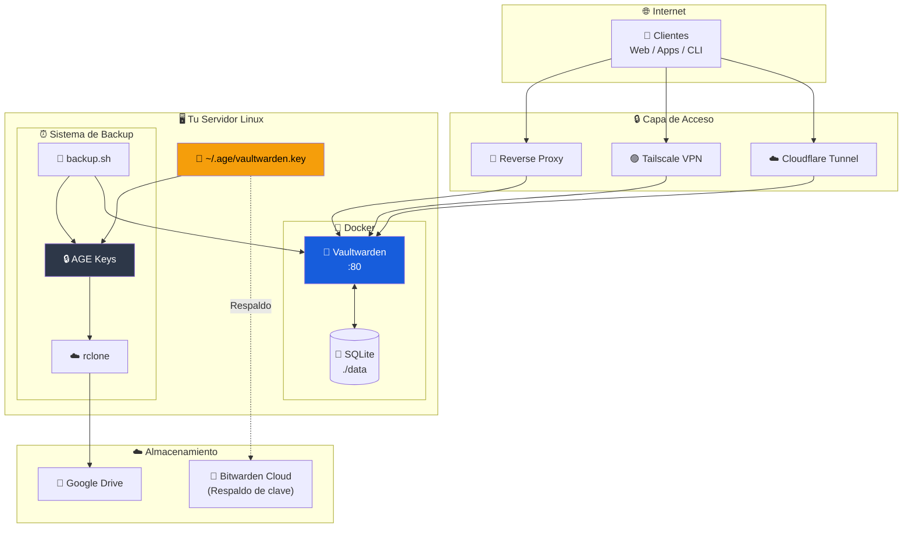

# 🔐 Vaultwarden Self-Hosted

> **Gestor de contraseñas auto-hospedado** — Alternativa ligera y compatible con Bitwarden, con backups cifrados automáticos a la nube.

[](https://www.docker.com/)
[](https://github.com/dani-garcia/vaultwarden)
[](https://age-encryption.org/)
[](LICENSE)

---

## ✨ Características del Proyecto

| Característica                | Descripción                                              |
| :---------------------------- | :------------------------------------------------------- |
| 🐳 **Docker Compose**          | Despliegue simple con un solo comando                    |
| 🌐 **Acceso Flexible**         | Cloudflare Tunnel, Tailscale, Reverse Proxy o IP local   |
| 🔐 **Cifrado AGE**             | Secretos y backups protegidos con claves criptográficas  |
| ☁️ **Backup a la Nube**        | Respaldos automáticos con rclone (Drive, S3, etc.)       |
| 📱 **Notificaciones Telegram** | Alertas de estado en cada backup                         |
| ⏰ **Cron 100% Automático**    | Backups diarios sin intervención ni terminal             |
| 🧹 **Retención Inteligente**   | Limpieza automática de backups antiguos                  |

---

## 💎 Funciones Premium GRATIS

Vaultwarden desbloquea **todas las funciones que Bitwarden cobra** en su plan Premium o de Organización.

| Función Premium | Bitwarden ($$) | Vaultwarden (Gratis) |
| :--- | :---: | :---: |
| 🔐 **TOTP Authenticator** | $10/año | ✅ Incluido |
| 🛡️ **2FA Físico (YubiKey)** | $10/año | ✅ Incluido |
| 📊 **Reportes de Salud** | $10/año | ✅ Incluido |
| 📎 **Adjuntos Cifrados** | 1GB (Global) | 💾 Ilimitado (Tu Disco) |
| 🆘 **Acceso de Emergencia** | $10/año | ✅ Incluido |
| 🏢 **Organizaciones** | $40/año | ♾️ Ilimitadas |

### 📋 Detalle de Beneficios

1. **Autenticador Integrado (TOTP)**
   Genera códigos de verificación de dos pasos (6 dígitos) directamente en la app. En la versión gratuita oficial solo puedes guardar la semilla, pero no generar códigos.

2. **2FA Avanzada (Hardware)**
   Soporte completo para llaves físicas de seguridad (**YubiKey, FIDO2/WebAuthn**) y Duo. Bitwarden Free solo permite correo o apps básicas.

3. **Reportes de Salud (Vault Health)**
   Análisis de seguridad que detecta:
   - Contraseñas expuestas en brechas de datos (Have I Been Pwned).
   - Contraseñas reutilizadas o débiles.
   - Sitios web sin HTTPS.

4. **Archivos Adjuntos y "Send"**
   - **Adjuntos**: Sube documentos e imágenes cifrados a tus ítems. Límite definido solo por el espacio de tu servidor.
   - **Send**: Comparte archivos cifrados mediante enlaces temporales (Bitwarden Free solo permite texto).

5. **Organizaciones Ilimitadas**
   Crea grupos para compartir contraseñas con familiares, amigos o equipos de trabajo sin el límite de 2 usuarios/colecciones.

6. **Acceso de Emergencia**
   Designa contactos de confianza que pueden solicitar acceso a tu bóveda tras un tiempo de espera si tú no puedes hacerlo.

> 💡 **Nota (2026)**: Para obtener estas ventajas, el compromiso es **autoalojar** (self-host) el servicio en tu propio hardware (VPS, Raspberry Pi, NAS) y encargarte de la seguridad y backups, tal como facilita este proyecto.

---

## 🏆 ¿Por qué Vaultwarden?

### Ventajas vs Bitwarden Cloud

| Aspecto              | Bitwarden Cloud     | Vaultwarden Self-Hosted      |
| :------------------- | :------------------ | :---------------------------- |
| **Costo**            | $10-40/año          | 🆓 Gratis                      |
| **Datos**            | En servidores USA   | 🏠 En TU servidor              |
| **Privacidad**       | Confías en ellos    | 🔐 100% tuyo                   |
| **Funciones Premium**| Requiere pago       | ✅ Todas incluidas             |
| **Límite usuarios**  | Según plan          | ♾️ Ilimitados                  |
| **Almacenamiento**   | 1GB adjuntos        | 💾 Sin límite                  |
| **Personalización**  | Limitada            | 🔧 Total control               |
| **Disponibilidad**   | Depende de ellos    | 🖥️ Tú controlas               |

### Características de Vaultwarden

- 🦀 **Escrito en Rust** - Extremadamente rápido y eficiente
- 💾 **Bajo consumo** - ~10MB RAM, perfecto para Raspberry Pi
- 🔄 **100% Compatible** - Funciona con todas las apps de Bitwarden
- 🌐 **API completa** - Web Vault, CLI, extensiones, apps móviles
- 🔓 **Código abierto** - Auditable y transparente
- 🐳 **Docker ready** - Despliegue en minutos

---

## 🔐 Sistema de Cifrado (AGE)

Este proyecto usa **AGE (Actually Good Encryption)** con **identity keys** (claves pública/privada) en lugar de passphrase.

### 📝 TL;DR - Resumen rápido

```
1. Generas UNA clave    →  ~/.age/vaultwarden.key
2. La guardas en Bitwarden Cloud (¡CRÍTICO!)
3. El backup usa esa clave automáticamente
4. Si pierdes el servidor, recuperas la clave de Bitwarden
5. ¡Listo! Puedes descifrar todos tus backups
```

### Flujo de cifrado



### 🔑 Ciclo de vida de las claves



### ¿Por qué identity keys?

| Método     | Modo Interactivo | Modo Cron | Recuperación       |
| :--------- | :--------------- | :-------- | :----------------- |
| Passphrase | ✅                | ❌ Falla   | ✅ Fácil            |
| **Identity Key** | ✅          | ✅ Funciona | ✅ Respaldar clave |

---

## 🏗️ Arquitectura



---

## 🚀 Inicio Rápido

### Requisitos Previos

- **Servidor Linux** con Docker instalado (Ubuntu, Debian, Fedora, Proxmox LXC, Raspberry Pi, etc.)
- **Dominio** (recomendado para HTTPS, pero opcional si usas Tailscale/IP Local)
- Herramientas: `age`, `rclone`, `bw` (Bitwarden CLI), `curl`

### 1. Clonar el repositorio

```bash
git clone https://github.com/herwingx/vaultwarden-self-hosted.git /opt/vaultwarden
cd /opt/vaultwarden
```

### 2. Instalar dependencias

```bash
# Fedora
dnf install -y age rclone curl

# Ubuntu/Debian
apt update && apt install -y age rclone curl

# Bitwarden CLI (requiere Node.js)
npm install -g @bitwarden/cli
```

### 3. Generar clave de cifrado (IMPORTANTE)

```bash
./scripts/manage_secrets.sh setup
```

Esto genera un par de claves AGE para cifrar/descifrar secretos.

> ⚠️ **CRÍTICO**: Guarda la clave que se muestra en pantalla en **Bitwarden Cloud** u otro lugar seguro. Sin esta clave, **no podrás recuperar tus backups** si pierdes el servidor.

### 4. Configurar secretos

```bash
# Copiar plantilla
cp .env.example .env

# Editar con tus valores
nano .env
```

Variables principales:

```env
# API Keys (Vaultwarden -> Ajustes -> Seguridad -> Keys)
BW_HOST=https://vault.tudominio.com   # URL del servidor (Config Server para CLI)
BW_CLIENTID=user.xxxxxxxx-xxxx-xxxx-xxxx-xxxxxxxxxxxx
BW_CLIENTSECRET=tu_client_secret
BW_PASSWORD=tu_contraseña_maestra

# Telegram (Bot @BotFather, ID con @userinfobot)
TELEGRAM_TOKEN=123456:ABC-token
TELEGRAM_CHAT_ID=123456789

# Rclone (gdrive, s3, dropbox, etc.)
RCLONE_REMOTE=gdrive:Backups/Vaultwarden
```

### 5. Cifrar secretos

```bash
./scripts/manage_secrets.sh encrypt
```

### 6. Levantar Vaultwarden

```bash
./scripts/start.sh
```

### 7. Configurar acceso
 
 Esta guía cubre tres escenarios principales:
 
 1. **Con Dominio** (Cloudflare Tunnel) - Recomendado, automático con HTTPS.
 2. **Sin Dominio** (Tailscale) - Acceso privado y seguro.
 3. **Local** (IP del servidor) - Solo red local.

<details>
<summary><strong>🔷 Opción A: Cloudflare Tunnel (Recomendado)</strong></summary>

Sin abrir puertos en tu router. Requiere cuenta en Cloudflare.

1. En **Cloudflare Zero Trust** → **Tunnels** → crear tunnel
2. Añadir **Public Hostname**:

| Campo     | Valor                   |
| :-------- | :---------------------- |
| Subdomain | `vault`                 |
| Domain    | `tudominio.com`         |
| Service   | `http://vaultwarden:80` |

3. Copiar el token del tunnel a `docker-compose.yml`

</details>
 
 <details>
 <summary><strong>🟣 Opción B: Sin Dominio (Tailscale / Red Privada)</strong></summary>
 
 Ideal si no quieres comprar un dominio y quieres acceder desde fuera de casa de forma segura.
 
 #### 0. Instalar Tailscale (si no lo tienes)
 ```bash
 curl -fsSL https://tailscale.com/install.sh | sh
 sudo tailscale up
 ```
 
 #### 1. Modificar `docker-compose.yml`
 Como no usaremos Cloudflare, debemos exponer el puerto manualmente. Edita el archivo y:
 1. Descomenta la sección `ports`.
 2. Comenta el servicio `cloudflared`.
 
 ```yaml
 services:
   vaultwarden:
     ports:
       - "8080:80"  # <--- Descomentar esto (Host:Contenedor)
     # ...
   
   # cloudflared:   <--- Comentar o borrar este bloque
   #   ...
 ```
 
 #### 2. Reiniciar
 ```bash
 ./scripts/start.sh
 ```
 
 #### 3. Configurar `.env` para backups
 El script de backup necesita saber dónde encontrar tu Vaultwarden. Al estar en el mismo servidor, usa localhost:
 
 ```bash
 # En tu archivo .env
 BW_HOST=http://localhost:8080
 ```
 
 #### 4. Acceder
 1. Obtén tu IP de Tailscale: `tailscale ip -4`
 2. Accede desde el navegador: `http://TU_IP_TAILSCALE:8080`
 3. Desde el móvil: Instala la app de Tailscale, actívala y usa esa misma URL.
 
 > ⚠️ **NOTA SOBRE HTTPS**: Los navegadores modernos (Chrome, Safari) bloquean funciones criptográficas en sitios **HTTP** (no seguros).
 > - **Solución 1**: Usar Firefox (es más permisivo).
 > - **Solución 2**: Usar **Tailscale HTTPS** (comando `tailscale cert`) para tener un dominio seguro `.ts.net`.
 > - **Solución 3**: Las apps móviles y de escritorio de Bitwarden suelen funcionar bien permitiendo conexiones HTTP en sus ajustes.
 
 </details>

<details>
<summary><strong>🟢 Opción C: Reverse Proxy (Nginx, Traefik, Caddy)</strong></summary>

Si ya tienes un reverse proxy configurado, apunta a `localhost:8080`.

</details>

### 8. Crear cuenta y cerrar registros (CRÍTICO)
 
 1. Accede a tu Vaultwarden y crea tu cuenta de administrador.
 2. Una vez creada, **deshabilita nuevos registros** editando tus secretos:
 
 ```bash
 # 1. Editar secretos
 ./scripts/manage_secrets.sh edit
 ```
 
 ```env
 # Cambiar a false dentro del editor
 SIGNUPS_ALLOWED=false
 ```
 
 3. Reiniciar para aplicar:
 ```bash
 docker compose up -d
 ```
 
 ### 9. Configurar backups automáticos

```bash
# Añadir al crontab (backup diario a las 3:00 AM)
crontab -e
```

```cron
0 3 * * * /opt/vaultwarden/scripts/backup.sh >> /var/log/vaultwarden_backup.log 2>&1
```

> ✅ **¡Listo!** Vaultwarden está corriendo con backups automáticos cifrados.

---

## 💾 Gestión de Datos y Persistencia

Toda la información de tu instancia se guarda estrictamente en el directorio `./data`. Este volumen está montado en `docker-compose.yml` y persiste entre reinicios.

**Contenido de `./data`:**
- `db.sqlite3`: La base de datos completa (usuarios, cifrado, organizaciones).
- `attachments/`: Archivos adjuntos subidos a las bóvedas.
- `icon_cache/`: Caché de iconos de sitios web.
- `config.json`: Configuraciones específicas del servidor.

### ⚠️ Nota sobre los Backups
El script de backup automático (`./scripts/backup.sh`) realiza una **exportación de la bóveda (JSON)** usando Bitwarden CLI.
- ✅ **Incluye**: Contraseñas, notas, tarjetas, identidades.
- ❌ **No incluye**: Archivos adjuntos (Attachments).

**Si usas archivos adjuntos**, te recomendamos respaldar periódicamente la carpeta `./data` completa o sincronizarla con `rclone`.

---

## 🔄 Respaldo y Recuperación de Clave

> ⚠️ **CRÍTICO**: Sin la clave privada, tus backups son **irrecuperables**. Guárdala AHORA.

### 📋 Respaldar clave en Bitwarden Cloud

1. **Ver tu clave completa**:
   ```bash
   ./scripts/manage_secrets.sh show-key
   ```

2. **En Bitwarden Cloud** (bitwarden.com, NO tu Vaultwarden):
   - Crear nueva **Secure Note**
   - Nombre: `🔐 Vaultwarden Recovery Key`
   - Contenido: Pegar TODO el contenido que muestra el comando
   
   Ejemplo de contenido:
   ```
   # Vaultwarden AGE Key - Creada: 2026-01-05
   # public key: age15yu005zkql3g6wqc4pr3822247wujzmy9atlzjsnq03jk6su797q346qjq
   AGE-SECRET-KEY-1ABCDEFGHIJKLMNOPQRSTUVWXYZ...
   ```

### 🆘 Recuperación de Desastres Completa

Si perdiste el servidor y necesitas recuperar todo:

1. **Recuperar clave desde Bitwarden Cloud**:
   ```bash
   mkdir -p ~/.age && chmod 700 ~/.age
   nano ~/.age/vaultwarden.key  # Pegar desde tu Secure Note
   chmod 600 ~/.age/vaultwarden.key
   ```

2. **Clonar y Descifrar**:
   ```bash
   git clone https://github.com/tu-usuario/vaultwarden-self-hosted.git
   cd vaultwarden-self-hosted
   ./scripts/manage_secrets.sh decrypt 
   ```

3. **Restaurar Backup**:
   ```bash
   # Descargar y descifrar
   rclone copy gdrive:Backups/Vaultwarden/vw_backup_LAST.json.age /tmp/
   age -d -i ~/.age/vaultwarden.key -o /tmp/backup.json /tmp/vw_backup_LAST.json.age
   
   # Levantar e Importar
   ./scripts/start.sh
   # Web Vault -> Ajustes -> Importar -> Bitwarden (json) -> /tmp/backup.json
   ```

---

## 📦 Despliegue en Múltiples Servidores

Si quieres replicar en otro servidor (LXC, VPS, etc.).

### Opción A: Transferir clave (SCP)

```bash
scp ~/.age/vaultwarden.key root@nuevo-servidor:/root/.age/
```

### Opción B: Múltiples claves (Más seguro)

1. Generar nueva clave en el servidor nuevo: `./scripts/manage_secrets.sh setup`
2. Recifrar el `.env` con ambas claves públicas usando `age -r PUB1 -r PUB2`.

---

## 🔧 Comandos Útiles

```bash
# Gestión
./scripts/manage_secrets.sh [setup|encrypt|decrypt|edit|view|show-key]

# Servicio
./scripts/start.sh
docker compose logs -f

# Backup Manual
./scripts/backup.sh
```

---

## 📁 Estructura del Proyecto

```
vaultwarden/
├── docker-compose.yml       # Configuración de servicios
├── .env.example             # Plantilla de variables
├── .env.age                  # 🔒 Secretos cifrados (Git)
├── data/                    # 🔒 Datos persistentes (NO Git)
├── scripts/
│   ├── install.sh           # Setup automatizado
│   ├── start.sh             # Launcher
│   ├── backup.sh            # Script de backup CLI
│   └── manage_secrets.sh    # Wrapper de AGE
└── README.md
```

---

## 🛠️ Stack Tecnológico

**Servidor**
- **Vaultwarden**: Servidor compatible con Bitwarden (Rust)
- **Docker**: Contenedorización

**Seguridad**
- **AGE**: Cifrado con claves (identity files)
- **Cloudflare Tunnel / Tailscale**: Acceso seguro (opcional)

**Backup**
- **Bitwarden CLI**: Exportación de bóveda
- **Rclone**: Sincronización con la nube
- **Telegram Bot API**: Notificaciones

---

## 🔒 Seguridad

- ✅ Secretos cifrados con AGE + identity keys
- ✅ Backups cifrados antes de subir a la nube
- ✅ Clave privada respaldada en Bitwarden Cloud
- ✅ Archivos sensibles excluidos de Git
- ✅ Registro deshabilitado después de crear cuenta
- ✅ Soporte para 2FA/TOTP
- ✅ Múltiples opciones de acceso seguro

---

## 📚 Documentación

| Documento | Descripción |
| :--- | :--- |
| [Vaultwarden Wiki](https://github.com/dani-garcia/vaultwarden/wiki) | Documentación oficial |
| [AGE Encryption](https://age-encryption.org/) | Cifrado moderno |
| [Rclone Docs](https://rclone.org/docs/) | Sincronización con nube |

---

## ❓ Solución de Problemas Frecuentes

### 1. "Requires HTTPS" / Criptografía falla
Los navegadores bloquean criptografía en HTTP.
- **Solución**: Usa Firefox, habilita `chrome://flags/#unsafely-treat-insecure-origin-as-secure` o usa HTTPS (Cloudflare/Tailscale).

### 2. Backup error: "not logged in"
Revisa `BW_HOST`. Si usas docker local, debe ser `http://localhost:PUERTO`.

---

## 🤝 Contribuir

1. Fork del repositorio
2. `git checkout -b feat/nueva-feature`
3. `git commit -m "feat: descripción"`
4. Pull Request

---

## 📄 Licencia

Este proyecto está bajo la licencia MIT. Ver [LICENSE](LICENSE) para más detalles.
