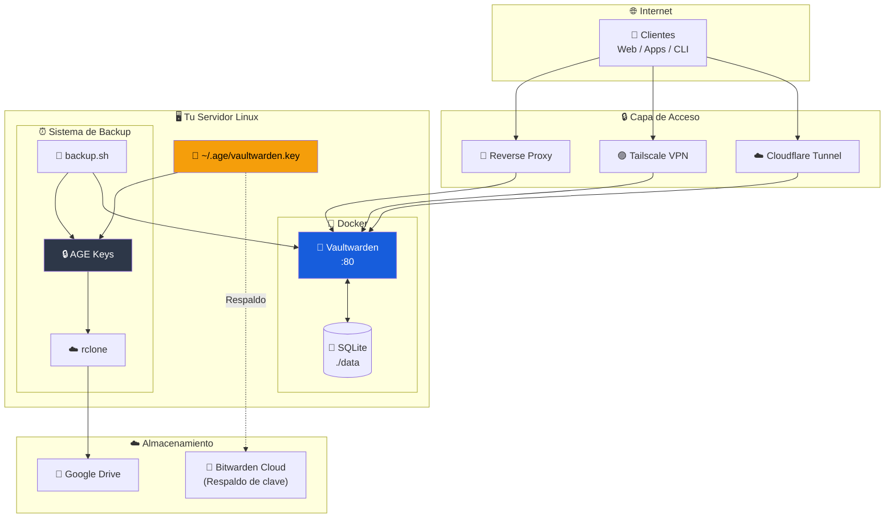

# 🔐 Vaultwarden Self-Hosted

> **Gestor de contraseñas auto-hospedado** — Alternativa ligera y compatible con Bitwarden, con backups cifrados automáticos a la nube.

[](https://www.docker.com/)
[](https://github.com/dani-garcia/vaultwarden)
[](https://age-encryption.org/)
[](LICENSE)

---

## ✨ Características del Proyecto

| Característica                | Descripción                                              |
| :---------------------------- | :------------------------------------------------------- |
| 🐳 **Docker Compose**          | Despliegue simple con un solo comando                    |
| 🌐 **Acceso Flexible**         | Cloudflare Tunnel, Tailscale, Reverse Proxy o IP local   |
| 🔐 **Cifrado AGE**             | Secretos y backups protegidos con claves criptográficas  |
| ☁️ **Backup a la Nube**        | Respaldos automáticos con rclone (Drive, S3, etc.)       |
| 📱 **Notificaciones Telegram** | Alertas de estado en cada backup                         |
| ⏰ **Cron 100% Automático**    | Backups diarios sin intervención ni terminal             |
| 🧹 **Retención Inteligente**   | Limpieza automática de backups antiguos                  |

---

## 💎 Funciones Premium GRATIS

Vaultwarden incluye **todas las funciones de Bitwarden Premium** sin costo:

| Función Premium              | Bitwarden Cloud | Vaultwarden |
| :--------------------------- | :-------------: | :---------: |
| 🔑 **TOTP Authenticator**     | $10/año         | ✅ Gratis    |
| 📎 **Archivos adjuntos**      | $10/año         | ✅ Gratis    |
| 🚨 **Informes de seguridad**  | $10/año         | ✅ Gratis    |
| 🔐 **Acceso de emergencia**   | $10/año         | ✅ Gratis    |
| 👥 **Organizaciones**         | $40/año         | ✅ Gratis    |
| 🔗 **Bitwarden Send**         | Limitado        | ✅ Ilimitado |
| 🔒 **Vault Health Reports**   | $10/año         | ✅ Gratis    |
| 🎨 **Iconos personalizados**  | $10/año         | ✅ Gratis    |

---

## 🏆 ¿Por qué Vaultwarden?

### Ventajas vs Bitwarden Cloud

| Aspecto              | Bitwarden Cloud     | Vaultwarden Self-Hosted      |
| :------------------- | :------------------ | :---------------------------- |
| **Costo**            | $10-40/año          | 🆓 Gratis                      |
| **Datos**            | En servidores USA   | 🏠 En TU servidor              |
| **Privacidad**       | Confías en ellos    | 🔐 100% tuyo                   |
| **Funciones Premium**| Requiere pago       | ✅ Todas incluidas             |
| **Límite usuarios**  | Según plan          | ♾️ Ilimitados                  |
| **Almacenamiento**   | 1GB adjuntos        | 💾 Sin límite                  |
| **Personalización**  | Limitada            | 🔧 Total control               |
| **Disponibilidad**   | Depende de ellos    | 🖥️ Tú controlas               |

### Características de Vaultwarden

- 🦀 **Escrito en Rust** - Extremadamente rápido y eficiente
- 💾 **Bajo consumo** - ~10MB RAM, perfecto para Raspberry Pi
- 🔄 **100% Compatible** - Funciona con todas las apps de Bitwarden
- 🌐 **API completa** - Web Vault, CLI, extensiones, apps móviles
- 🔓 **Código abierto** - Auditable y transparente
- 🐳 **Docker ready** - Despliegue en minutos

---

## 🚀 Inicio Rápido

### Requisitos Previos

- **Servidor Linux** con Docker instalado (Ubuntu, Debian, Fedora, Proxmox LXC, Raspberry Pi, etc.)
- **Dominio** (opcional, para acceso remoto con HTTPS)
- Herramientas: `age`, `rclone`, `bw` (Bitwarden CLI), `curl`

### 1. Clonar el repositorio

```bash
git clone https://github.com/herwingx/vaultwarden-self-hosted.git /opt/vaultwarden
cd /opt/vaultwarden
```

### 2. Instalar dependencias

```bash
# Fedora
dnf install -y age rclone curl

# Ubuntu/Debian
apt update && apt install -y age rclone curl

# Bitwarden CLI (requiere Node.js)
npm install -g @bitwarden/cli
```

### 3. Generar clave de cifrado (IMPORTANTE)

```bash
./scripts/manage_secrets.sh setup
```

Esto genera un par de claves AGE para cifrar/descifrar secretos.

> ⚠️ **CRÍTICO**: Guarda la clave que se muestra en pantalla en **Bitwarden Cloud** u otro lugar seguro. Sin esta clave, **no podrás recuperar tus backups** si pierdes el servidor.

### 4. Configurar secretos

```bash
# Copiar plantilla
cp secrets.env.example .env

# Editar con tus valores
nano .env
```

Variables principales:

```env
# API Keys (Vaultwarden -> Ajustes -> Seguridad -> Keys)
BW_HOST=https://vault.tudominio.com
BW_CLIENTID=user.xxxxxxxx-xxxx-xxxx-xxxx-xxxxxxxxxxxx
BW_CLIENTSECRET=tu_client_secret
BW_PASSWORD=tu_contraseña_maestra

# Telegram (Bot @BotFather, ID con @userinfobot)
TELEGRAM_TOKEN=123456:ABC-token
TELEGRAM_CHAT_ID=123456789

# Rclone (gdrive, s3, dropbox, etc.)
RCLONE_REMOTE=gdrive:Backups/Vaultwarden
```

### 5. Cifrar secretos

```bash
./scripts/manage_secrets.sh encrypt
```

### 6. Levantar Vaultwarden

```bash
./scripts/start.sh
```

### 7. Configurar acceso (elige una opción)

<details>
<summary><strong>🔷 Opción A: Cloudflare Tunnel (Recomendado)</strong></summary>

Sin abrir puertos en tu router. Requiere cuenta en Cloudflare.

1. En **Cloudflare Zero Trust** → **Tunnels** → crear tunnel
2. Añadir **Public Hostname**:

| Campo     | Valor                   |
| :-------- | :---------------------- |
| Subdomain | `vault`                 |
| Domain    | `tudominio.com`         |
| Service   | `http://vaultwarden:80` |

3. Copiar el token del tunnel a `docker-compose.yml`

</details>

<details>
<summary><strong>🟣 Opción B: Tailscale (Red privada)</strong></summary>

Acceso seguro solo desde tus dispositivos con Tailscale instalado.

```bash
curl -fsSL https://tailscale.com/install.sh | sh
tailscale up
```

Acceder desde: `http://100.x.x.x:8080`

</details>

<details>
<summary><strong>🟢 Opción C: Reverse Proxy (Nginx, Traefik, Caddy)</strong></summary>

Si ya tienes un reverse proxy configurado, apunta a `localhost:8080`.

</details>

### 8. Configurar backups automáticos

```bash
# Añadir al crontab (backup diario a las 3:00 AM)
crontab -e
```

```cron
0 3 * * * /opt/vaultwarden/scripts/backup.sh >> /var/log/vaultwarden_backup.log 2>&1
```

> ✅ **¡Listo!** Vaultwarden está corriendo con backups automáticos cifrados.

---

## 🔐 Sistema de Cifrado (AGE)

Este proyecto usa **AGE (Actually Good Encryption)** con **identity keys** (claves pública/privada) en lugar de passphrase.

### 📝 TL;DR - Resumen rápido

```
1. Generas UNA clave    →  ~/.age/vaultwarden.key
2. La guardas en Bitwarden Cloud (¡CRÍTICO!)
3. El backup usa esa clave automáticamente
4. Si pierdes el servidor, recuperas la clave de Bitwarden
5. ¡Listo! Puedes descifrar todos tus backups
```

### ¿Por qué identity keys?

| Método     | Modo Interactivo | Modo Cron | Recuperación       |
| :--------- | :--------------- | :-------- | :----------------- |
| Passphrase | ✅                | ❌ Falla   | ✅ Fácil            |
| **Identity Key** | ✅          | ✅ Funciona | ✅ Respaldar clave |

### Flujo de cifrado

```
┌──────────────────────────────────────────────────────────────┐
│  CIFRADO (con clave pública)                                 │
│  .env  ──▶  [ age1abc... ]  ──▶  .env.age                    │
└──────────────────────────────────────────────────────────────┘

┌──────────────────────────────────────────────────────────────┐
│  DESCIFRADO (con clave privada)                              │
│  .env.age  ──▶  [ AGE-SECRET-KEY-1... ]  ──▶  .env           │
└──────────────────────────────────────────────────────────────┘
```

### 🔑 Ciclo de vida de las claves

```
┌─────────────────────────────────────────────────────────────────────┐
│                        SETUP INICIAL                                 │
│                                                                      │
│   ./manage_secrets.sh setup                                          │
│            │                                                         │
│            ▼                                                         │
│   ┌─────────────────┐     ┌──────────────────────────────────────┐  │
│   │ ~/.age/         │     │ GUARDAR EN BITWARDEN CLOUD           │  │
│   │ vaultwarden.key │ ──▶ │ (Secure Note con todo el contenido)  │  │
│   └─────────────────┘     └──────────────────────────────────────┘  │
│         │                              │                             │
│         │ Clave local                  │ Respaldo seguro             │
│         ▼                              ▼                             │
│   ┌─────────────┐              ┌─────────────────┐                  │
│   │ Cifrar/     │              │ Recuperación    │                  │
│   │ Descifrar   │              │ de desastres    │                  │
│   │ backups     │              │ si pierdes      │                  │
│   │ localmente  │              │ el servidor     │                  │
│   └─────────────┘              └─────────────────┘                  │
└─────────────────────────────────────────────────────────────────────┘
```

### Comandos de gestión de secretos

```bash
./scripts/manage_secrets.sh setup      # Generar par de claves
./scripts/manage_secrets.sh encrypt    # Cifrar .env -> .env.age
./scripts/manage_secrets.sh decrypt    # Descifrar .env.age -> .env
./scripts/manage_secrets.sh edit       # Editar y re-cifrar
./scripts/manage_secrets.sh view       # Ver sin guardar
./scripts/manage_secrets.sh show-key   # Mostrar clave para respaldar
```

---

## 🔄 Respaldo y Recuperación de Clave

### 📋 Respaldar clave en Bitwarden Cloud

> ⚠️ **CRÍTICO**: Sin la clave privada, tus backups son **irrecuperables**. Guárdala AHORA.

1. **Ver tu clave completa**:
   ```bash
   ./scripts/manage_secrets.sh show-key
   ```

2. **En Bitwarden Cloud** (bitwarden.com, NO tu Vaultwarden):
   - Crear nueva **Secure Note**
   - Nombre: `🔐 Vaultwarden Recovery Key`
   - Contenido: Pegar TODO el contenido que muestra el comando
   
   Ejemplo de contenido a guardar:
   ```
   # Vaultwarden AGE Key - Creada: 2026-01-05
   # Servidor: LXC Proxmox / VPS / etc.
   
   # created: 2026-01-05T10:40:00-06:00
   # public key: age15yu005zkql3g6wqc4pr3822247wujzmy9atlzjsnq03jk6su797q346qjq
   AGE-SECRET-KEY-1ABCDEFGHIJKLMNOPQRSTUVWXYZ...
   
   # Instrucciones de recuperación:
   # 1. mkdir -p ~/.age && chmod 700 ~/.age
   # 2. nano ~/.age/vaultwarden.key  (pegar este contenido)
   # 3. chmod 600 ~/.age/vaultwarden.key
   ```

3. **Verificar** que puedes acceder a la nota desde otro dispositivo

### 🔄 Transferir clave a otro servidor

**Opción A: Copiar directamente (SCP)**

```bash
# Desde el servidor ORIGEN
scp ~/.age/vaultwarden.key root@NUEVO-SERVIDOR:/root/.age/

# En el servidor DESTINO
chmod 600 ~/.age/vaultwarden.key
```

**Opción B: Copiar manualmente**

```bash
# En el servidor ORIGEN - mostrar clave
cat ~/.age/vaultwarden.key

# En el servidor DESTINO - crear archivo
mkdir -p ~/.age && chmod 700 ~/.age
nano ~/.age/vaultwarden.key    # Pegar el contenido
chmod 600 ~/.age/vaultwarden.key
```

**Opción C: Desde Bitwarden Cloud**

```bash
# En el nuevo servidor
mkdir -p ~/.age && chmod 700 ~/.age
nano ~/.age/vaultwarden.key    # Pegar desde tu Secure Note
chmod 600 ~/.age/vaultwarden.key

# Verificar
./scripts/manage_secrets.sh view
```

### 🆘 Recuperación de Desastres Completa

Si perdiste el servidor y necesitas recuperar todo:

1. **Recuperar clave desde Bitwarden Cloud**:
   ```bash
   mkdir -p ~/.age && chmod 700 ~/.age
   nano ~/.age/vaultwarden.key  # Pegar desde tu Secure Note
   chmod 600 ~/.age/vaultwarden.key
   ```

2. **Clonar repositorio**:
   ```bash
   git clone https://github.com/tu-usuario/vaultwarden-self-hosted.git
   cd vaultwarden-self-hosted
   ```

3. **Descifrar secretos**:
   ```bash
   ./scripts/manage_secrets.sh view      # Verificar que funciona
   ./scripts/manage_secrets.sh decrypt   # Descifrar a .env
   ```

4. **Recuperar backup de la nube**:
   ```bash
   # Listar backups disponibles
   rclone ls gdrive:Backups/Vaultwarden
   
   # Descargar el más reciente
   rclone copy gdrive:Backups/Vaultwarden/vw_backup_FECHA.json.age /tmp/
   
   # Descifrar
   age -d -i ~/.age/vaultwarden.key -o /tmp/backup.json /tmp/vw_backup_FECHA.json.age
   ```

5. **Levantar Vaultwarden**:
   ```bash
   ./scripts/start.sh
   ```

6. **Importar datos**:
   - Accede a la web → **Ajustes** → **Importar datos** → **Bitwarden (json)**
   - Selecciona `/tmp/backup.json`

7. **Limpiar archivos temporales**:
   ```bash
   rm -f /tmp/backup.json /tmp/*.json.age
   ```

> 💡 **Tip**: Prueba el proceso de recuperación en un servidor de prueba ANTES de necesitarlo.

---

## 🏗️ Arquitectura



---

## 📁 Estructura del Proyecto

```
vaultwarden/
├── docker-compose.yml       # Configuración de Vaultwarden
├── secrets.env.example      # Plantilla de variables de entorno
├── .env.age                  # 🔒 Secretos cifrados (va a Git)
├── .gitignore                # Excluye claves y datos sensibles
├── data/                    # 🔒 Datos de Vaultwarden (NO va a Git)
├── scripts/
│   ├── install.sh           # Instalación y configuración
│   ├── start.sh             # Iniciar servicios
│   ├── backup.sh            # Backup automatizado
│   └── manage_secrets.sh    # Gestor de secretos y claves
├── LICENSE
└── README.md
```

---

## 🔧 Comandos Útiles

```bash
# Instalación completa
./scripts/install.sh

# Gestión de claves
./scripts/manage_secrets.sh setup      # Primera vez: generar clave
./scripts/manage_secrets.sh show-key   # Ver clave para respaldar

# Gestión de secretos
./scripts/manage_secrets.sh encrypt    # Cifrar .env
./scripts/manage_secrets.sh decrypt    # Descifrar a .env
./scripts/manage_secrets.sh edit       # Editar y re-cifrar
./scripts/manage_secrets.sh view       # Ver sin guardar

# Servicios
./scripts/start.sh                     # Iniciar Vaultwarden
docker compose logs -f                 # Ver logs
docker compose down && ./scripts/start.sh  # Reiniciar

# Backup
./scripts/backup.sh                    # Ejecutar backup manual
```

---

## 📦 Despliegue en Múltiples Servidores

Si quieres replicar en otro servidor (LXC, VPS, etc.):

### Opción A: Misma clave (más simple)

```bash
# Desde el servidor original
scp ~/.age/vaultwarden.key root@nuevo-servidor:/root/.age/
```

### Opción B: Diferentes claves (más seguro)

```bash
# En el nuevo servidor, generar su propia clave
./scripts/manage_secrets.sh setup

# Obtener clave pública
NEW_PUB=$(age-keygen -y ~/.age/vaultwarden.key)

# En el servidor original, re-cifrar para ambas claves
OLD_PUB=$(age-keygen -y ~/.age/vaultwarden.key)
age -d -i ~/.age/vaultwarden.key .env.age > /tmp/secrets.env
age -r "$OLD_PUB" -r "$NEW_PUB" -o .env.age /tmp/secrets.env
rm /tmp/secrets.env

git commit -am "chore: añadir recipiente para nuevo servidor"
git push
```

---

## 🛠️ Stack Tecnológico

**Servidor**
- **Vaultwarden**: Servidor compatible con Bitwarden (Rust)
- **Docker**: Contenedorización

**Seguridad**
- **AGE**: Cifrado con claves (identity files)
- **Cloudflare Tunnel / Tailscale**: Acceso seguro (opcional)

**Backup**
- **Bitwarden CLI**: Exportación de bóveda
- **Rclone**: Sincronización con la nube
- **Telegram Bot API**: Notificaciones

---

## 🔒 Seguridad

- ✅ Secretos cifrados con AGE + identity keys
- ✅ Backups cifrados antes de subir a la nube
- ✅ Clave privada respaldada en Bitwarden Cloud
- ✅ Archivos sensibles excluidos de Git
- ✅ Registro deshabilitado después de crear cuenta
- ✅ Soporte para 2FA/TOTP
- ✅ Múltiples opciones de acceso seguro

---

## 📚 Documentación

| Documento                                                                                           | Descripción             |
| :-------------------------------------------------------------------------------------------------- | :---------------------- |
| [Vaultwarden Wiki](https://github.com/dani-garcia/vaultwarden/wiki)                                 | Documentación oficial   |
| [AGE Encryption](https://age-encryption.org/)                                                       | Cifrado moderno         |
| [Rclone Docs](https://rclone.org/docs/)                                                             | Sincronización con nube |
| [Tailscale](https://tailscale.com/kb/)                                                              | VPN mesh                |
| [Cloudflare Tunnel](https://developers.cloudflare.com/cloudflare-one/connections/connect-networks/) | Túneles seguros         |

---

## 🤝 Contribuir

1. Fork del repositorio
2. Crear rama: `git checkout -b feat/nueva-feature`
3. Commit: `git commit -m "feat: descripción"`
4. Push: `git push origin feat/nueva-feature`
5. Crear Pull Request

---

## 📄 Licencia

Este proyecto está bajo la licencia MIT. Ver [LICENSE](LICENSE) para más detalles.
